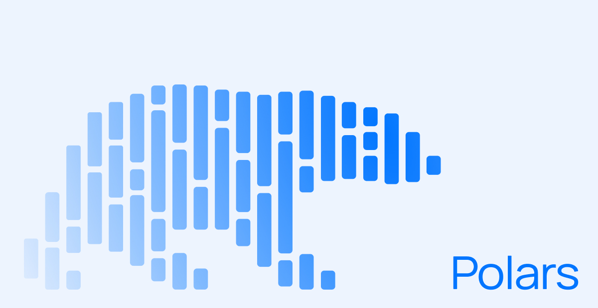

<!--
**inam07-gif/inam07-gif** is a ✨ _special_ ✨ repository because its `README.md` (this file) appears on your GitHub profile.

Here are some ideas to get you started:

- 🔭 I’m currently working on ...
- 🌱 I’m currently learning ...
- 👯 I’m looking to collaborate on ...
- 🤔 I’m looking for help with ...
- 💬 Ask me about ...
- 📫 How to reach me: ...
- 😄 Pronouns: ...
- ⚡ Fun fact: ...
-->
# 👋 Hi, I'm Muhammed Inam Ul Haq  

🎓 **Pursuing Data Science & Artificial Intelligence**  
📊 Interested in **Machine Learning, Data Analysis, and AI-driven solutions**

---

## 🧠 Tech Stack

  
  
  
  
  
  
  

---

## 🤖 Areas of Interest
- Machine Learning  
- Data Science  
- Data Analysis  
- Data Visualization  
- Statistical Modeling  

---

## Technical Skills

**Programming & Libraries**
- Python  
- NumPy  
- Pandas  

**Machine Learning & Analytics**
- Scikit-learn  
- Statistical Modeling  
- Supervised & Unsupervised Learning  

**Data Visualization**
- Matplotlib  
- Seaborn  

## 🔗 Connect with Me

  
  

---

## 💻 About Me

I am a **Data Science & AI student** passionate about transforming **raw data into meaningful insights**.  
I work primarily with **Python** and enjoy building **machine learning models**, performing **data analysis**, and creating clear, impactful **visualizations**.

---

⭐ *Consistent learning. Clean code. Better models.*

